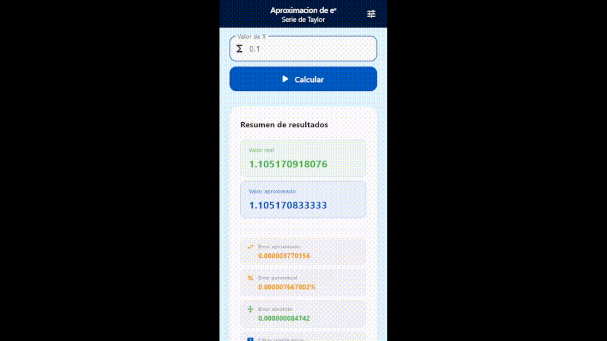

> ⚠️ This text may contain translation errors. You can read the Spanish version here: [README-es.md](docs/README-es.md)

# algex 📐

Flutter application that approximates **e^x** using the Taylor series method, with configurable convergence settings, error analysis, and four real-time convergence charts.

---

## 🚀 Overview

algex implements the Taylor series expansion of e^x from scratch — no external math libraries — with full control over the convergence criterion, tolerance, and precision. The calculation engine is pure Dart, completely decoupled from Flutter, and covered by unit tests.

Includes:

- Taylor series calculator with two convergence modes
- Per-iteration error analysis (absolute, relative, approximate, percent)
- Significant figures tracking per iteration
- Four convergence charts rendered with fl_chart
- Persistent settings via SharedPreferences
- Responsive layout with breakpoints for compact and wide screens

---

## 🎥 Demo

| Mobile view | Desktop view |
|---|---|
|  |  |

---

## ✨ Visible features

- Enter any real value of x and compute e^x via Taylor series
- Switch between **absolute error** convergence (compares against real e^x) and **approximate error** (compares consecutive iterations)
- Configure tolerance value and maximum iterations
- View per-iteration breakdown: partial sum, term value, all error types, significant figures
- Toggle between iterations table and charts with animated slide indicator
- Show or hide the real e^x value alongside the approximation
- Configure decimal precision (2–12 digits) for all displayed values
- Settings persist across sessions

---

## 🧠 Technical highlights

- **Pure Dart calculator**
  - `ExpCalculator` has zero Flutter dependencies — pure logic
  - Covered by unit tests in `test/exp_calculator_test.dart`
  - Handles NaN/Infinity correctly for all error types in both convergence modes

- **State management without external libraries**
  - `InheritedNotifier<SettingsNotifier>` propagates settings through the widget tree
  - No Riverpod, no Bloc, no Provider — only Flutter core APIs
  - `SettingsScope.of(context)` for clean access at any depth

- **Persistence**
  - Settings loaded asynchronously on startup via `SharedPreferences`
  - Writes parallelized with `Future.wait` — no sequential disk I/O
  - `copyWith` pattern keeps defaults in a single place in `Settings`

- **Responsive UI**
  - `LayoutBuilder` breakpoints at 400px (input), 600px (cards and metrics)
  - `ModeToggle` collapses to icon-only below 150px per item
  - All layouts tested at both compact and wide widths

- **Charts**
  - Four charts sharing a single `ChartCard` base widget
  - Shared helpers: `chartAutoInterval`, `chartXInterval`, `chartValidSpots`, `chartTitles`, `chartBorder`, `chartGrid`
  - X-axis interval auto-calculated from available width to prevent label overlap
  - `ChartUnavailable` fallback for modes where data is not computable

---

## 🎯 What this project demonstrates

- State management with `InheritedWidget` + `ChangeNotifier` without third-party packages
- Clean separation between pure Dart logic (`core/`) and Flutter UI (`ui/`)
- Unit testing of mathematical logic with edge case coverage
- Responsive layout design with `LayoutBuilder` and breakpoints
- Async persistence with `SharedPreferences` using parallelized writes
- Custom animated widgets: `AnimatedContainer`, `AnimatedAlign`, `TweenAnimationBuilder`
- Sliver-based scrolling architecture (`CustomScrollView`, `SliverList`, `SliverAppBar`)

---

## 🏗 Architecture

The project separates pure logic from UI into two independent layers (ui + core).
```
lib/
├── core/                        # Pure Dart — no Flutter dependency
│   ├── model/
│   │   ├── calculation_result.dart   # Output of a calculation run
│   │   ├── iteration_data.dart       # Data for a single iteration
│   │   └── settings.dart             # App settings + ToleranceType enum
│   └── service/
│       └── exp_calculator.dart       # Taylor series engine
│
└── ui/                          # Flutter layer
    ├── pages/
    │   ├── home_page.dart            # Main screen
    │   └── settings_page.dart        # Settings screen
    ├── state/
    │   └── settings_notifier.dart    # InheritedNotifier + ChangeNotifier
    └── widgets/
        ├── adjust/                   # Settings UI components
        │   ├── adjust_convergence.dart
        │   ├── adjust_visualization.dart
        │   ├── adjust_section_header.dart
        │   ├── adjust_textfield.dart
        │   └── chip_option.dart
        ├── charts/                   # Chart components
        │   ├── chart_card.dart       # Base card + shared helpers
        │   ├── convergence_chart.dart
        │   ├── error_chart.dart
        │   ├── significant_figures_chart.dart
        │   └── term_decay_chart.dart
        ├── base_card.dart
        ├── input_sliver.dart
        ├── iterations_view.dart
        ├── mode_toggle.dart
        ├── result_summary_card.dart
        └── algex_sliver_appbar.dart
```

➡️ See full technical documentation: [technical.md](docs/technical.md)

---

## ⚙️ Quick start

### Requirements

- Flutter SDK `>=3.3.4`
- Android or iOS device / emulator

### Clone and run
```bash
git clone https://github.com/tristecsv/algex.git
cd algex

flutter pub get
dart run flutter_launcher_icons
flutter run
```

### Run tests
```bash
flutter test
```
